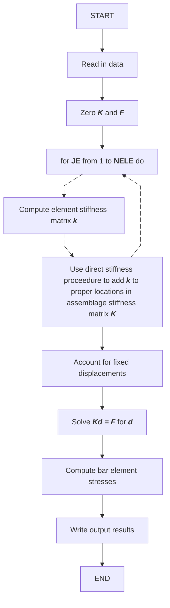

# `TRUSS` Finite Element Model Program Design Documentation

## Flowchart of the program
This flowchart is taken more or less verbatim from the book. I did pseudocode-ize the loop stuff and render it as a mermaid chart



## General Steps for modeling data for the program
1. Establish the global coordinate axes ($x$, $y$, and $z$). At each node $j$, displacements will then be decomposed into $x$, $y$, and $z$ components
2. Number the elements and the nodes. Identify the total number of elements and nodes
3. Specify the nodal coordinates, which result in $x_j$, $y_j$, and $z_j$ representing the coordinates of each node $j$
4. Specify the support or boundary conditions. That is, specify the degrees of freedom that are to be zero at each support node.
5. Specify the loads or forces in the global-coordinate components at the nodes. _**NOTE**_: In the program `TRUSS` $F_{1j}$, $F_{2j}$, $F_{3j}$ are the $x$, $y$, and $z$ components of the possible forces acting at node $j$
6. Specify the connectivity or topology (which nodes connect to which elements)
7. Describe the element properties. For each truss element specify the modulus of eleasticity and cross-sectional area

## General Notes for entering data into the program
### Important Variable Definitions
You'll use these in the format below. The variables are in whatever Fortran form was popular in 1992 for the author -- hard for me to understand intuitively at first
- `I`: directions $x$, $y$, $z$ as `1`, `2`, `3`
- `J`: the Jth node number/index
- `K`: the Kth node number/index
- `NELE`: number of elements in the finite element model
- `NNODE`: number of nodes in the finite element model
- `IFIX(I,J)`: a value of 1 means the node J is fixed in that direction of travel, 0 means it is free
- `XC(J)`, `YC(J)`, `ZC(J)`: the coordinates of the node J
- `FORCE(I,J)`: The force applied in the Ith direction at the Jth node
- `NODE(1,K)`, `NODE(2,K)`: The associated node numbers that are either end of an element
- `E(K)`: the elastic modulus of an element
- `A(K)`: the cross-sectional area of an element
### Data File Format
Each of the programs (Fortran, C, Python) will strive to accept input the same archaic way the Fortran programs did from the original text. 

The way it is described in the text, a subroutine named `DATA` took a text file that looked something like the file below. This file is figure 4-9 in the text, which is a 3 element truss system where all nodes are fixed except one which is on a roller, where a load is also applied. The nodes have identical elastic moduli but differing cross-sectional area

```
SPACE TRUSS EXAMPLE OF SECTION 3.7
3,4
1,0,1,0,72.0,0.,0.,0.,0.,-1000.0
2,1,1,1,0.0,36.0,0.,0.,0.,0.
3,1,1,1,0.0,36.0,72.0,0.,0.,0.
4,1,1,1,0.0,0.0,-48.0,0.,0.,0.
1,1,4,1.2E+6,0.187
2,1,2,1.2E+6,0.302
3,1,3,1.2E+6,0.729
```

#### **Line 1** 
is the identifying title of the problem being solved
- This is an alphanumeric string limited to 80 characters

#### **Line 2**
is the number of elements and nodes in the truss
- `NELE,NNODE`

#### **Lines 3-6**
describe the node information
- `J,IFIX(1,J),IFIX(2,J),IFIX(3,J),XC(J),YC(J),ZC(J),FORCE(1,J),FORCE(2,J),FORCE(3,J)`

#### **Lines 7-9**
describe the element information
- `K,NODE(1,K),NODE(2,K),E(K),A(K)`

## Expected Output
For the above problem, the expected output is also given (shown below). In the output `MUD` is the number of nonzero upper codiagonals needed in the stiffness matrix.

```
SPACE TRUSS EXAMPLE OF SECTION 3.7

NUMBER OF ELEMENTS(NELE) = 3
NUMBER OF NODES(NNODE)   = 4

NODE POINTS
K     IFIX        XC(K)           YC(K)           ZC(K)
1    0 1 0    7.200000E+01    0.000000E+00    0.000000E+00
2    1 1 1    0.000000E+01    3.600000E+01    0.000000E+00
3    1 1 1    0.000000E+01    3.600000E+01    7.200000E+01
4    1 1 1    0.000000E+01    0.000000E+00   -4.800000E+01

               FORCE(1,K)      FORCE(2,K)      FORCE(3,K)
              0.000000E+00    0.000000E+00   -1.000000E+03
              0.000000E+00    0.000000E+00    0.000000E+00
              0.000000E+00    0.000000E+00    0.000000E+00
              0.000000E+00    0.000000E+00    0.000000E+00

   ELEMENTS
K      NODE(1,K)          E(K)               A(K)
1        1   4         1.2000E+06        1.8700E-01
2        1   2         1.2000E+06        3.0200E-01
3        1   3         1.2000E+06        7.2900E-01

NUMBER OF NONZERO UPPER CODIAGONALS(MUD) = 11

 DISPLACEMENTS       X            Y            Z
NODE NUMBER 1   -0.7111E-01   0.0000E+00  -0.2662E+00
NODE NUMBER 2    0.0000E+00   0.0000E+00   0.0000E+00
NODE NUMBER 3    0.0000E+00   0.0000E+00   0.0000E+00
NODE NUMBER 4    0.0000E+00   0.0000E+00   0.0000E+00

STRESSES IN ELEMENTS (IN CURRENT UNITS)

ELEMENT NUMBER     STRESS
          1 =    -0.28685E+04
          2 =    -0.94819E+03
          3 =     0.14454E+04
```
